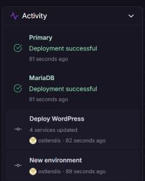
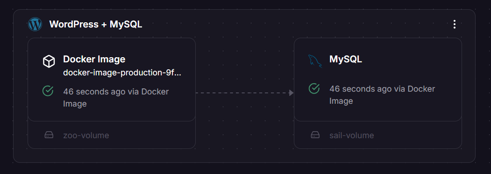

# Arbeit 1: Evaluation eines Cloud-Providers

## Inhaltsverzeichnis
TODO

## Arbeitsauftrag 1

### Vorstellung Railway
Railway ist eine Cloud-Platform die einem erlaubt vereinfacht Applikationen zu bauen, deployen und zu skalieren. Services lassen sich über Docker-images starten oder aber auch über source code aus einem Github Repository. Ebenso lassen sich mit wenigen Klicks Datenbanken hochfahren und mit Services vernetzen.  
Railway bietet einen modernen, intuitiven visuellen Canvas welcher Übersicht über die Services bietet und gleichzeitig die Oberfläche bereitstellt seine Services zu konfigurieren.

TODO

### Fragen

Frage: Können alle Teammitglieder die Applikation deployen?  
Antwort: Ja, alle Teammitglieder können die Applikation starten, entfernen und auch bearbeiten.

Frage: Können Sie Benutzer und Zugriffsrechte fürs Deployment verwalten?  
Antwort: Nein. Man kann User zum Projekt einladen welche entweder read-only oder read-write access haben.
Eine granulare einstellung ist nicht möglich

Frage: Bietet der Provider die Möglichkeit z.B. ein GitHub-/GitLab-Repository zu verbinden und dieses automatisch zu deployen?  
Antwort: Ja, das ist mehr oder weniger der hauptaspekt von Railway

Frage: Weshalb haben Sie diesen Provider für die Evaluation ausgewählt?  
Antwort: todo

Frage: Welche Möglichkeiten haben Sie, die Applikation zu starten und zu stoppen?  
Antwort: todo

Frage: Gibt es die Möglichkeit, das Deployment zu automatisieren? Welche Schritte wären dazu
nötig?  
Antwort: todo

Frage: Wo können Sie das Log der Applikation betrachten? Sehen Sie auch die einzelnen HTTP
Requests und Responses?  
Antwort: todo

Frage: Worin sehen Sie die Vor- und Nachteile Ihres Providers verglichen mit a9s?  
Antwort: todo

## Arbeitsauftrag 2
### OSSM-Analyse
#### On-Demand
Der On-Demand Aspekt ist auf Railway klar gewährleistet. Nach dem Anmelden oder registrieren kann man direkt loslegen indem ein Template gestartet wird oder ein Github-Repo verknüpft. Kurze Zeit später (bis zu 2 Minuten) ist die Applikation funktionsfähig.  
Zum Beispiel lässt sich jederzeit das Wordpress Template starten:  
  
Innerhalb Sekunden und ohne warten lässt sich ein Service starten. Es wurde zuerst von einem leeren Projekt gestartet und schliesslich sind alle Services funktionsfähig.  
  

#### Self-Service
Bei Rawilway lassen sich alle On-Demand Services via Self-Service selbst managen. Man hat gewisse Einschränkungen wenn man sich auf dem Trial-Plan befindet im Gegensatz zu einem bezahlten Plan befindet. Man müsste also zuerst seinen Plan upgraden, will man einen Service vom bezahlten Plan nutzen. Allerdings lässt sich auch dies innerthalb von kurzer Zeit ohne direkte Kommunikation mit Railway machen. Man kann also beliebig Services starten, ohne sich mit dem Provider absprechen zu müssen.  
Dies lässt sich ebenfalls aus den obigen Bildern entnehmen, da innert kurzer zeit ein neues Projekt angelegt wurde, und danach Datenbank- und Webserver hochgefahren wurden welche kurze zeit später vollständig funktionieren.

#### Skalierbarkeit
Bei Railway lässt sich sowohl horizontal als auch vertikal skalieren. Vertikale skalierbarkeit ist durch die anzahlt CPU-Kerne und die Menge an Arbeitsspeicher erreichbar, ist aber eingeschränkt, auf welchem Zahl-Plan man momentan fährt. Ist man gratis unterwegs, hat man keine Möglichkeit vertikal zu skalieren. Beim Hobby und Pro Plan sind 8GB Arbeisspeicher und 8 CPU's respektive 32GB Arebeitsspeicher und 32 CPU's pro Service verfügbar.
Siehe [Pläne](https://railway.com/workspace/plans)  
Die Hrizontale Skalierbarkeit ist vergliche zu grösseren Anbietern auch minimalistisch. Ist kein Dateisystem am Service angehängt und es sind keine Cronjobs definiert, lassen sich die Services manuell um eine gewünschte Anzahl replizieren und somit Skalieren. 
TODO

## tmpdoc

- Logged into railway with github account
- looked at nextjs example
- created github repo and copied files from previous java exercise into repo
- created railway project and selected github repo as source
- building and deploying went automatic, zero input and configuration required, WTF
- created a domain so app is now accessible from web

